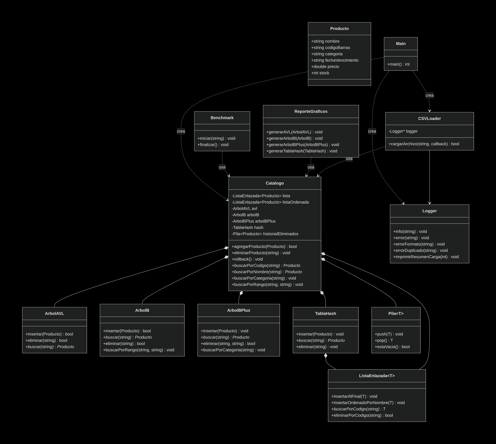

# Sistema de Gestion de Catalogo de Productos de Supermercado

## Descripcion

Aplicacion de consola en C++ que gestiona un catalogo de productos de supermercado implementando multiples estructuras de datos desde cero:

- Lista Enlazada (no ordenada y ordenada)
- Arbol AVL (busqueda por nombre)
- Arbol B (busqueda por rango de fechas)
- Arbol B+ (busqueda por categoria)
- Tabla Hash (busqueda por codigo de barras)
- Pila (rollback/deshacer eliminaciones)

## Caracteristicas

- Carga masiva desde archivos CSV (+1000 productos)
- Busqueda optimizada por codigo de barras (Hash - O(1) promedio)
- Busqueda por nombre (AVL - O(log n))
- Busqueda por categoria (Arbol B+ - O(log n + k))
- Busqueda por rango de fechas (Arbol B - O(log n + k))
- Eliminacion con rollback (Pila)
- Medicion de tiempos de ejecucion (Benchmark)
- Generacion de reportes visuales en PNG (Graphviz)
- Validacion robusta de datos CSV


## Documentacion

- [ManualDeUsuarioProyecto1](ManualDeUsuarioProyecto1.pdf)
- [TADSProyecto1](TADSProyecto1.pdf)
- [ReporteTecnicoEDD](ReporteTecnicoEDD.pdf)

## Diagrama de Clases (UML)



## Requisitos Previos

- **Compilador:** g++ con soporte para C++11 o superior
- **CMake:** (opcional, para compilacion automatica)
- **Graphviz:** Para generar reportes visuales (PNG)
- **Sistema Operativo:** Linux (Ubuntu recomendado), macOS o Windows (WSL)


### Instalacion de Graphviz (Ubuntu/Debian)

```bash
sudo apt update
sudo apt install graphviz
```
### Formas de compilar el Proyecto

### Usando Makefile
```bash
# Compilar el proyecto
make build

# Ejecutar el programa
make run

# Limpiar archivos compilados
make clean

# Compilar y ejecutar (todo en uno)
make
```

### Compilacion manual con g++
```bash

# Compilar todos los archivos
g++ main.cpp src/*.cpp -Iinclude -o Proyecto_1

# Ejecutar el programa
./Proyecto_1
```

### Usando CMake
```bash
mkdir -p build
cd build
cmake ..
make
./Proyecto_1
```

### Formato del Archivo CSV
El sistema acepta archivos CSV con el siguiente formato:
```bash
Nombre,CodigoBarra,Categoria,FechaCaducidad,Marca,Precio,Stock
Leche,001,Lacteos,2025-12-31,Lala,25.50,100
Pan,002,Panaderia,2025-10-15,Bimbo,15.00,50
Frijol,010,Legumbres,2025-08-20,La Ideal,2.10,500
```


